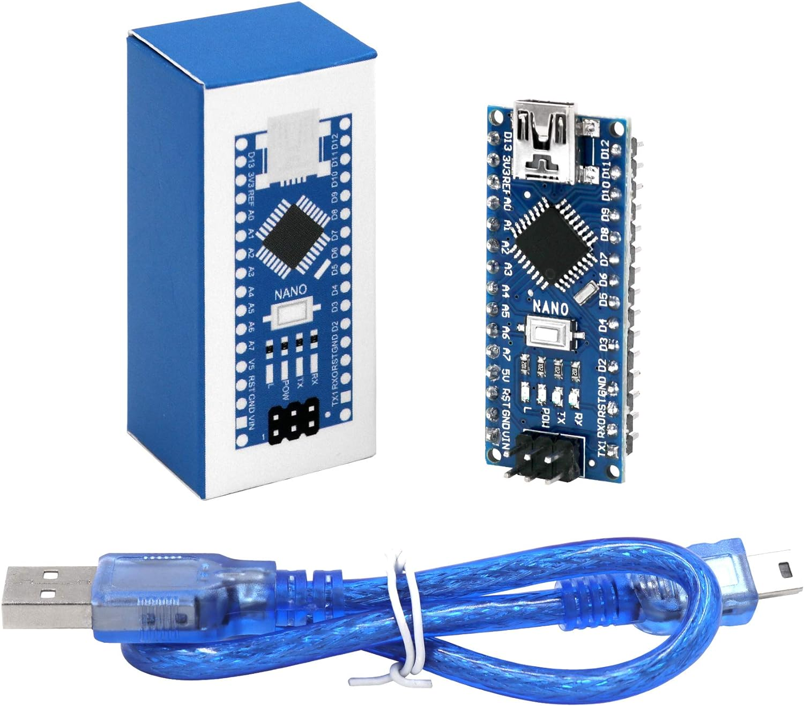
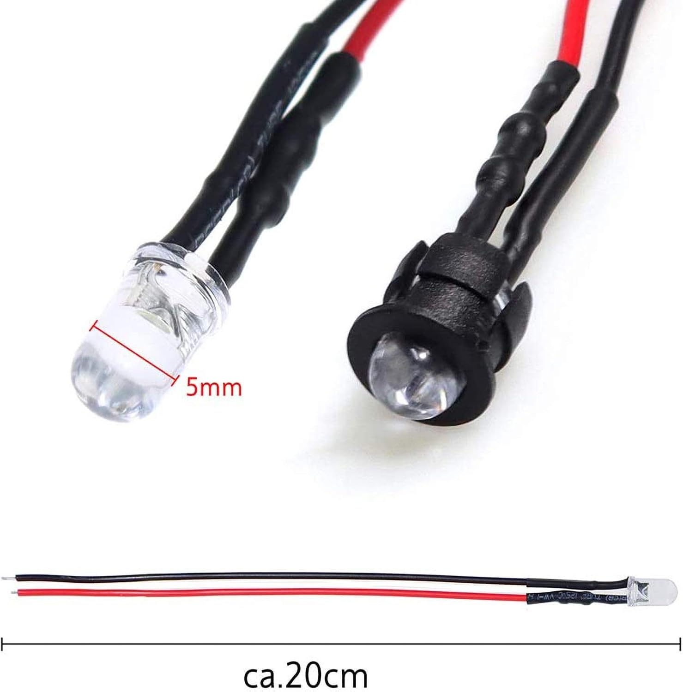

# The Sugar Vault

  
  

**Project Status:** Completed ✅

### Project Overview

The Sugar Vault is an Arduino-controlled candy dispenser that uses an Arduino Nano, NEMA 17 stepper motor, A4988 stepper motor driver, push button, LED indicator, DC-DC buck converter, and 3D-printed mechanical parts to dispense candy.

The goal of this project was to design and build a functional candy dispensing machine that uses a motorized dispensing system instead of a traditional hand-turned mechanical mechanism. The final system is activated when the user presses the green button on the front of the machine. When pressed, the button sends a signal to the Arduino Nano, which then controls the A4988 stepper motor driver. The motor driver powers the NEMA 17 stepper motor, causing the dispensing wheel to rotate. During the dispensing cycle, the green LED turns on to indicate that the wheel is moving. One button press rotates the dispensing wheel 360° to release candy.

This project was built to refresh and strengthen my basic engineering skills while giving me a better understanding of how to format, document, and organize future electronics and mechanical design projects.

### Main Components

## Main Components

<table>
  <tr>
    <th>Component</th>
    <th>Image</th>
  </tr>

  <tr>
    <td>Arduino Nano</td>
    <td></td>
  </tr>

  <tr>
    <td>A4988 stepper motor driver</td>
    <td></td>
  </tr>

  <tr>
    <td>NEMA 17 stepper motor</td>
    <td></td>
  </tr>

  <tr>
    <td>12V 2A power supply</td>
    <td></td>
  </tr>

  <tr>
    <td>DC-DC buck converter</td>
    <td></td>
  </tr>

  <tr>
    <td>Push button</td>
    <td></td>
  </tr>

  <tr>
    <td>Green LED</td>
    <td></td>
  </tr>

  <tr>
    <td>2.2 kΩ resistor</td>
    <td></td>
  </tr>

  <tr>
    <td>220 µF 25V electrolytic capacitor</td>
    <td></td>
  </tr>

  <tr>
    <td>3D-printed mechanical parts</td>
    <td></td>
  </tr>
</table>

